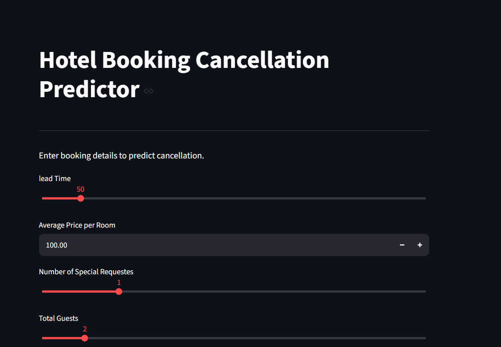
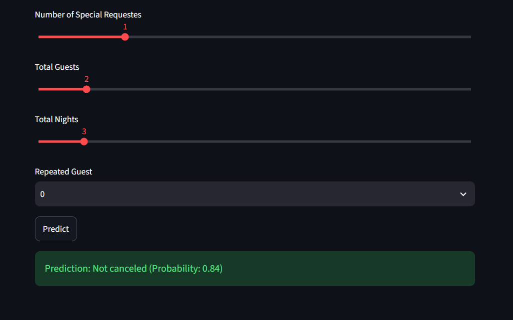

# 🏨 Hotel Booking Cancellation Predictor


A machine learning web application that predicts whether a hotel booking is likely to be **cancelled** or **not cancelled** using a **Gradient Boosting Classifier**. The application provides an intuitive interface where users can enter booking information and receive an instant prediction along with the model's confidence.

---

## 🌐 Live Demo

👉 https://hotel-booking-cancellation-predictor-3ly2.onrender.com/

---

## 📸 Screenshots

### Home Page



### Prediction Result



---

## 📖 Project Overview

Hotels lose significant revenue due to unexpected booking cancellations. This project uses machine learning to predict whether a booking is likely to be cancelled based on booking details such as:

- Lead Time
- Average Price per Room
- Number of Special Requests
- Total Guests
- Total Nights
- Repeated Guest Status

The trained model is deployed using **Streamlit** and hosted on **Render** for real-time predictions.

---

## 🚀 Features

- Predict hotel booking cancellations
- Interactive Streamlit user interface
- Real-time predictions
- Probability/confidence score
- Responsive web application
- Cloud deployment with Render

---

## 🧠 Machine Learning Pipeline

1. Data Collection
2. Data Cleaning
3. Feature Engineering
4. Exploratory Data Analysis
5. Train-Test Split
6. Hyperparameter Tuning using RandomizedSearchCV
7. Gradient Boosting Classifier Training
8. Model Evaluation
9. Model Serialization using Joblib
10. Web Application Deployment

---

## 📊 Model Information

| Item | Details |
|------|---------|
| Algorithm | Gradient Boosting Classifier |
| Framework | Scikit-learn |
| Hyperparameter Tuning | RandomizedSearchCV |
| Model Serialization | Joblib |

---

## 🛠️ Technologies Used

- Python
- Pandas
- NumPy
- Scikit-learn
- Joblib
- Streamlit
- Render
- Git
- GitHub

---

## 📂 Project Structure

```text
Hotel-Booking-Cancellation-Predictor
│
├── screenshots/
│   ├── home.png
│   └── prediction.png
│
├── app.py
├── notebook.ipynb
├── gb_booking_model.pkl
├── HotelData.xlsx
├── requirements.txt
├── render.yaml
├── README.md
└── .gitignore
```

---

## ⚙️ Installation

Clone the repository

```bash
git clone https://github.com/Blackthu/Hotel-Booking-Cancellation-Predictor.git
```

Navigate into the project

```bash
cd Hotel-Booking-Cancellation-Predictor
```

Install dependencies

```bash
pip install -r requirements.txt
```

Run the application

```bash
streamlit run app.py
```

---

## 📈 Future Improvements

- Add more booking features
- Display feature importance
- Improve UI/UX
- Add SHAP explanations for predictions
- Deploy with Docker
- Support batch predictions using CSV uploads

---

## 👨‍💻 Author

**Judson**

GitHub: https://github.com/Blackthu

---

## ⭐ Support

If you found this project useful, consider giving it a ⭐ on GitHub!
